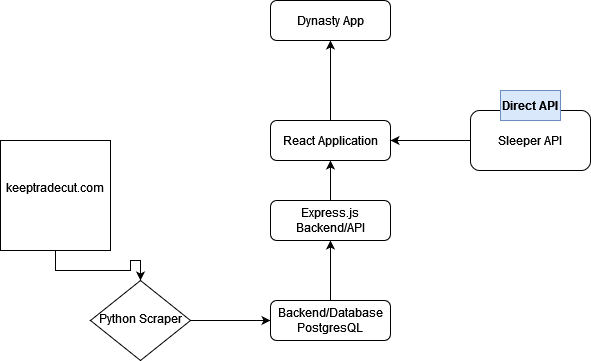

### Research & Planning Log

#### Friday, 09/15

- 2:00 pm, Research Sleeper Fantasy Football API
- 3:00 pm, Still reading trough API documentation
- 4:00 pm, watch React videos Zerotomastery.com

### Monday, 09/18

- 6 am, Create Sample project with React
- 7 am, Create Sample project with React Native

### Friday, 09/22

- 12 pm to 3 pm - continue building sample project from zerotomastery.com
  \*Building monsters rolodex.

## Sunday 09/24

- 10 pm to 12 am continuing sample project Monsters Rolodex
  \*worked on a single page application that creates a list of Monsters with an API Call.

## Monday 09/25

12 pm to 4 pm - Finished Monsters Rolodex

\_

